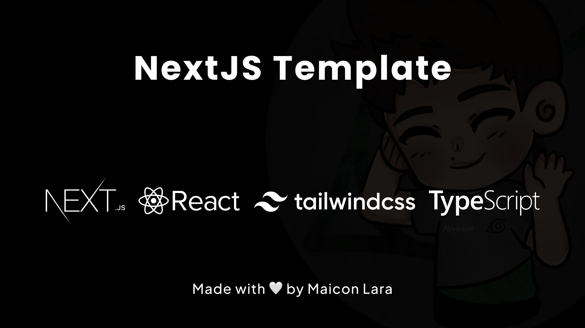

# React, NextJS, TypeScript and TailwindCSS Template.

<p align="center">
  <a href="https://github.com/maiconlara/nextjs-template"></a>
</p>

💻 A template written in React with Next.js. Created to make developer's life easier, contains: Next.js, TypeScript, ESLint, Prettier, Husky, Framer-Motion, PostCSS, Tailwind CSS.

This template is free to use in your own [Next.js](https://nextjs.org) project.

### Features

Developer experience first:

-   [Next.js](https://nextjs.org) as framework
-   Integrate with [Tailwind CSS](https://tailwindcss.com)
-   [TypeScript](https://www.typescriptlang.org) type inference
-   [Commitizen](https://commitizen.github.io/cz-cli) as standard commit tool
-   Linter with [ESLint](https://eslint.org)
-   Code Format with [Prettier](https://prettier.io)
-   Git Hooks with [Husky](https://typicode.github.io/husky)
-   Husky for Git Hooks

### Requirements

- Node.js and a Node Package Manager (use pnpm please)

### Getting started

Using the template:


1. On GitHub.com, navigate to the main page of the repository.
2. Above the file list, click Use this template.
3. Select Create a new repository.
4. Configure your own settings in github repo.
5. Click Create repository from template.


Then, you can run locally:

```
pnpm install
pnpm run dev
```

### Commiting
To commit you have to:

```
git add .
pnpm commit
follow the cli rules
```

### Structure

```
.
├── public               # Public folder
│   └── assets           # Image used in readme
├── src
│   ├── app              # Application folder
│   ├── assets           # Assets used in application
│   ├── components       # Elements use in pages
│   ├── lib              # Library configuration
│   └── utils            # Aux and reusable functions
│       └── hooks        # React and usable hooks
├── tailwind.config.ts   # Tailwind CSS configuration
└── tsconfig.json        # TypeScript configuration
```


<p align="center">Everyone is welcome to contribute to this project 🤍</p>